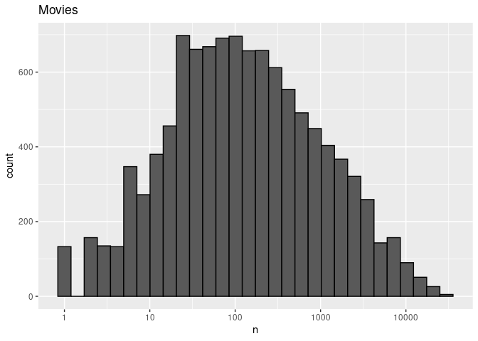
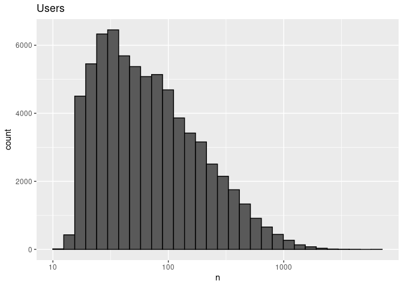

Final Report for Movie Recommendations (Linear Model)
================

## Introduction

The aim of this project is to develop a model to predict the ratings of
movies given a specific user-movie combination, the year the movie was
released and the genre of the movie.

The report will be split into 4 sections, the **introduction**, the
**analysis**, the **results**, and the **conclusion** section.

## Analysis

This section will involve a few key steps, namely **pre-processing**,
**data visualization**, and **model development**.

The section aims to come up with a successful model to predict the
ratings of a given user-movie combination with a root-mean-squared error
less than 0.85.

**Pre-processing**

The results of the given code divide our data into 2 sets, the
**validation** set and the **edx** set.

In this analysis, we will use split the **edx** set into training and
test sets, while the **validation** set will be used solely to evaluate
our final algorithm.  
We start off by running code to import our libraries and generate our
datasets from the movielens database.  
We use the semi\_join function to ensure that our user-movie
combinations are the same in both the edx and validation sets.

When we view the train\_x dataset, we observe 2 things,  
1. The year each movie is released is in the form of the number of days
starting from 1 Jan 1970.  
2. The genres of each movie fall into many different categories, making
it difficult to sort the data.

Our task is then to process this data into a more usable and convertible
form. The train\_x dataset is printed below.

``` r
train_x
```

    ##          userId movieId rating  timestamp
    ##       1:      1     122    5.0  838985046
    ##       2:      1     185    5.0  838983525
    ##       3:      1     231    5.0  838983392
    ##       4:      1     292    5.0  838983421
    ##       5:      1     316    5.0  838983392
    ##      ---                                 
    ## 8550053:  59269   59680    3.0 1229014701
    ## 8550054:  59269   64325    3.0 1229014646
    ## 8550055:  59342   61768    0.5 1230070861
    ## 8550056:  60713    4820    2.0 1119156754
    ## 8550057:  68986   61950    3.5 1223376391
    ##                                                    title
    ##       1:                             Bird of Prey (1996)
    ##       2:                                 Bad Moon (1996)
    ##       3: Wings of Desire (Der Himmel über Berlin) (1987)
    ##       4:                     Arsenic and Old Lace (1944)
    ##       5:                   Some Kind of Wonderful (1987)
    ##      ---                                                
    ## 8550053:                                            <NA>
    ## 8550054:                                            <NA>
    ## 8550055:                                            <NA>
    ## 8550056:                   Madea's Family Reunion (2006)
    ## 8550057:                                            <NA>
    ##                                genres
    ##       1:                       Action
    ##       2:      Action|Adventure|Horror
    ##       3: Comedy|Drama|Fantasy|Romance
    ##       4:      Comedy|Mystery|Thriller
    ##       5:                Drama|Romance
    ##      ---                             
    ## 8550053:                         <NA>
    ## 8550054:                         <NA>
    ## 8550055:                         <NA>
    ## 8550056:                 Comedy|Drama
    ## 8550057:                         <NA>

In order to analyse the variation of ratings across time (year), we
first need to process the data and convert the timestamp column to
years.  
To do so, we use the **as\_datetime** function in the **lubridate**
package.  
Code is as follows:

``` r
# convert timestamp column to year
train_x$timestamp <- as_datetime(train_x$timestamp) %>%
    format("%Y")
train_x$timestamp <- as.numeric(train_x$timestamp)
test_x$timestamp <- as_datetime(test_x$timestamp) %>%
    format("%Y")
test_x$timestamp <- as.numeric(test_x$timestamp)
val$timestamp <- as_datetime(val$timestamp) %>%
    format("%Y")
val$timestamp <- as.numeric(val$timestamp)
```

For the genres, we will be analysing them by grouping combinations of
genres with more than 500 ratings together.  
This will be done in a future section.

**Data Visualization**

To decide which factors we should consider in our model, we first need
to explore their variation amongst the dataset.

The plots show the variation in number of ratings movies were given and
the variation in how many ratings different users gave.  
<!-- --><!-- -->
There is significant variation amongst the number of ratings given for
movies, users and year.

This suggests the following trends.  
1. Different movies could have different inherent qualities that result
in different number of ratings, ie. blockbuster films vs unknown ones

2.  Different users have different levels of activity on the rating site

3.  Different years might have garnered more or less ratings due to
    number of movies released in the year, or external factors which
    affect ratings

4.  We can also assume that the genre of movies has a direct effect on
    its ratings, since action movies might be given higher ratings
    simply due to more people rating them

**Model Development**

Now that we have 4 different factors affecting our final rating, we can
define our linear model as such:

**rating(Y)** = **mean(u)** + **b\_i (movie effect)** + **b\_u (user
effect)** + **b\_t (year effect)** + **b\_g (genre effect)**

The end goal would be to derive a set of these 4 variables for each
user-movie combination, allowing us to estimate the rating.

The next step of our model development would be to define a function for
our root-mean-squared error (RMSE). Code is as follows:

``` r
RMSE <- function(true_ratings, predicted_ratings){
  sqrt(mean((true_ratings - predicted_ratings)^2))
}
```

Before we begin generating the 4 effects for our model, we can use
regularization to improve our data.

Since some large estimates of ratings can come from users who have rated
very few movies, or from really obscure movies, we can introduce a
penalty term lambda to shrink the values of the effects if their sample
size is small.

In order to determine the optimum value of lambda, we can perform cross
validation to choose the lambda which minimises the RMSE on the training
set.

The code is not run here, but can be referenced from the R Script. We
end up with an optimum lambda value of 4.8.

We can now begin to develop our model effects and append each effect to
the training set.

For genre effects, since there are many different combinations, we only
choose combinations to group the data by if the number of that specific
combination is more than 500.

Since the combinations that have less than 500 entries can be imagined
as more obscure, we will replace the NA values on their gender effect
with 0s.

We will also replace all effects which have NA values with 0, since if
the effects are not evaluated, they can be assumed to be insignificant.

The final training set and the code to generate the model is shown
below.

``` r
l <- 4.8
mu_hat <- mean(edx$rating)

# modelling movie effects
movie_avgs <- train_x %>%
    group_by(movieId) %>%
    summarize(b_i = sum(rating - mu_hat)/(n() + l))
train_x <- train_x %>%
    left_join(movie_avgs, by = "movieId")

# modelling user effects
user_avgs <- train_x %>%
    group_by(userId) %>%
    summarize(count = n(), b_u = sum(rating - mu_hat - b_i)/(n() + l))
user_avgs <- user_avgs[user_avgs$count > 10, ]
train_x <- train_x %>%
    left_join(user_avgs, by = "userId")
train_x$b_u[is.na(train_x$b_u)] <- 0

# modelling year effects
year_avgs <- train_x %>%
    group_by(timestamp) %>%
    summarize(b_t = sum(rating - mu_hat - b_i - b_u)/(n() + l))
train_x <- train_x %>%
    left_join(year_avgs, by = "timestamp")
train_x$b_t[is.na(train_x$b_t)] <- 0

# modelling genre effects
genre_avgs <- train_x %>%
    group_by(genres) %>%
    summarize(count = n(), b_g = sum(rating - mu_hat - b_i - b_u - b_t)/(n() + l))
genre_avgs <- genre_avgs[genre_avgs$count > 500, ]
train_x <- train_x %>%
    left_join(genre_avgs, by = "genres")
train_x$b_g[is.na(train_x$b_g)] <- 0

head(train_x)
```

    ##    userId movieId rating timestamp
    ## 1:      1     122      5      1996
    ## 2:      1     185      5      1996
    ## 3:      1     231      5      1996
    ## 4:      1     292      5      1996
    ## 5:      1     316      5      1996
    ## 6:      1     329      5      1996
    ##                                              title                       genres
    ## 1:                             Bird of Prey (1996)                       Action
    ## 2:                                 Bad Moon (1996)      Action|Adventure|Horror
    ## 3: Wings of Desire (Der Himmel über Berlin) (1987) Comedy|Drama|Fantasy|Romance
    ## 4:                     Arsenic and Old Lace (1944)      Comedy|Mystery|Thriller
    ## 5:                   Some Kind of Wonderful (1987)                Drama|Romance
    ## 6:                          Field of Dreams (1989)                        Drama
    ##          b_i count.x    b_u       b_t count.y         b_g
    ## 1: -0.645154      21 1.3918 0.0091713   68734 -0.00332940
    ## 2: -0.380524      21 1.3918 0.0091713   13380 -0.06895967
    ## 3: -0.573154      21 1.3918 0.0091713   28183 -0.02613706
    ## 4: -0.093876      21 1.3918 0.0091713   17348 -0.04094553
    ## 5: -0.162607      21 1.3918 0.0091713  272445  0.00081089
    ## 6: -0.179250      21 1.3918 0.0091713 1394394 -0.00490756

Next we will generate our predicted ratings and save it to the variable
**pred** in the **predicted\_ratings** variable.

The model is first evaluated on the test\_x set, and then the final RMSE
is computed on the validation set, **val**.

Lastly, we replace all predicted ratings that have NA values with a
value slightly below the mean. In this case we choose it to be 0.1 below
the mean rating.

The final RMSE is computed and returned as follows:

``` r
predicted_ratings$pred[is.na(predicted_ratings$pred)] <- mu_hat - 0.1
```

``` r
RMSE(test_x$rating, predicted_ratings$pred)
```

    ## [1] 0.86301

## Results

To test our final model and get the RMSE, we compute predictions based
on our validation set.

``` r
RMSE(val$rating, predicted_ratings$pred)
```

    ## [1] 0.86498

As we can see, we get a final RMSE of 0.86487, which achieves our goal
of getting a RMSE value of less than 0.85.

## Conclusion

The use of 4 different factors to model the variation of ratings across
user-movie combinations helps to reduce discrepancies and provide a more
realistic modelling of our data. However, the linear model used for this
statistical modelling is seldom effective when considering real-world
data which tends to **not** follow a linear model.

Furthermore, to fit a linear model, a better way would be to use the
**lm** function in the caret package. However, due to the limits of our
computational capacity, fitting such a model becomes impractical at our
level. The current method of estimating effects should suffice.

To extend this model, we could consider implementing matrix
factorization to analyze the user-movie variation for each user-movie
combination. We would calculate the residuals and implement singular
value decomposition to get the principal components of our
decomposition. This could further decrease our RMSE as it accounts for
user-movie variation which we did not consider in our current model.
